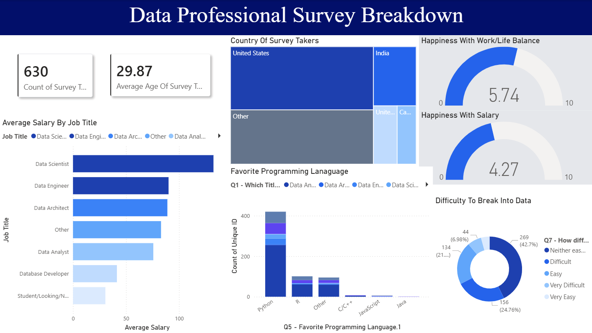

# 📊 Data-Professional-Survey-Analytics

This project explores survey responses from **630 data professionals** using Power BI. The goal was to understand how salary, satisfaction, career transitions, and industry entry barriers influence career experiences across different roles and regions.

**Tools:** Power BI, Power Query, DAX
**Dataset:** 630 survey responses from data professionals

---

## Dashboard Preview

---

## Overview

This project began as a survey dashboard exploring salary, job roles, programming languages, and satisfaction among data professionals.

The initial expectation was that compensation would explain most of the variation in how people felt about their careers. Instead, the data pointed toward a different story.

Many respondents appeared satisfied with the work itself—learning opportunities, coworkers, and work-life balance scored relatively well—but were less convinced about compensation and long-term progression.

The gap between enjoying the work and feeling rewarded by it became the central theme of the analysis.

---

## What the Satisfaction Scores Suggest

The survey asked respondents to rate several aspects of their professional lives.

Work-life balance averaged **5.74**, while salary satisfaction averaged **4.27**. Learning opportunities and coworker relationships scored noticeably higher.

At first glance, this does not look like a workforce in crisis. Most respondents are not reporting negative experiences on a day-to-day basis.

What stands out is that the strongest dissatisfaction appears around future outcomes rather than present experiences. The issue seems less about enjoying the job and more about uncertainty regarding where the job leads.

---

## Entry Difficulty Leaves a Mark

One of the more interesting patterns involved respondents who reported difficulty entering the field.

These individuals tended to report lower satisfaction across multiple dimensions even after reaching data-related roles.

The dataset cannot explain causation, but it raises an interesting possibility: breaking into the field may not be a temporary hurdle. The experience itself may continue influencing how people evaluate their careers long after they have entered the industry.

In practical terms, the first step into the profession may matter more than many organizations assume.

---

## Career Switchers Tell a Different Story

Career switchers produced a result that initially seemed counterintuitive.

They did not consistently earn more than non-switchers. In some cases, they earned less.

Yet many reported stronger satisfaction levels.

One possible explanation is that switchers evaluate their current role against what they left behind rather than against industry averages. The move into data may improve autonomy, flexibility, or intellectual engagement before it improves compensation.

The transition appears to create psychological gains faster than economic ones.

---

## The Learning-Pay Gap

Another recurring pattern emerged when comparing learning satisfaction with salary satisfaction.

A sizeable portion of respondents reported feeling more satisfied with what they were learning than with what they were earning.

Early in a career, this can be healthy. Learning often acts as a form of future compensation.

The challenge appears when that tradeoff lasts too long. At some point, professionals expect the skills they are building to translate into economic rewards. When that conversion does not happen, dissatisfaction begins to grow.

---

## Observed Workforce Patterns

Several recurring career patterns appeared while exploring the survey responses. Although these are not formal statistical segments, they provide a useful framework for interpreting how different groups experience the industry.

### Established & Secure

* Higher salaries
* Lower entry difficulty
* More balanced satisfaction scores

This group appears closest to a stable long-term career outcome.

### Remote-First Optimists

* Moderate salaries
* Strong preference for flexibility
* Positive views on learning and work-life balance

For these respondents, remote work may partially offset dissatisfaction with compensation.

### Salary-Seeking Strivers

* Lower compensation relative to expectations
* Strong focus on salary growth when considering future roles

Their responses suggest unresolved economic concerns rather than dissatisfaction with the work itself.

### Career-Switcher Strain

* Transitioned from other careers into data
* Faced higher entry difficulty
* Still waiting for expected career returns

Their frustration appears tied more to delayed payoff than to dislike of the field.

---

## Geography and Technical Preferences

The largest respondent groups came from the United States and India, with noticeable differences in compensation between regions.

While part of that gap reflects local labor markets, it also reflects how organizations position data roles. In some markets, data functions operate as strategic decision-making assets. In others, they remain primarily operational support roles.

Python emerged as the most commonly preferred programming language among respondents.

However, preferred tools do not necessarily reflect market value. Compensation outcomes are influenced by many factors beyond programming language choice alone, including role specialization, industry, experience, and geography.

Popularity and economic value do not always move together.

---

## Dashboard Overview

The Power BI dashboard includes:

* KPI cards for respondent count and average age
* Country distribution treemap
* Work-life and salary satisfaction indicators
* Average salary by job title
* Programming language preferences
* Difficulty entering the field distribution

Power Query was used for data cleaning and transformation, while DAX was used for calculations and dashboard measures.

---

## Data Cleaning & Preparation

The raw survey dataset required several cleaning steps before analysis.

* Removed columns that were not relevant to the dashboard objectives
* Standardized text values using Find & Replace to improve consistency across categories
* Converted columns to appropriate data types for analysis and visualization
* Processed salary ranges by splitting text values and deriving representative salary figures for comparison
* Used delimiter-based transformations to separate predefined survey options from additional user-entered responses
* Simplified free-text responses where necessary to improve reporting and visual clarity

Most cleaning and transformation work was performed in Power Query before building measures and visuals in Power BI.

---

## Files Included

* `Data Professional Survey Breakdown.pbix`
* `Survey-Raw-Data.xlsx`
* `Dashboard.png`

---

## Limitations

This analysis is based on self-reported survey responses and should be interpreted as directional rather than causal.

The observed relationships may reflect factors not captured within the dataset, and the findings should be viewed as indicators of broader patterns rather than proof of cause-and-effect relationships.

As with most survey-based analyses, the results are best used to generate questions and insights rather than definitive conclusions.

---

## Final Takeaway

The strongest pattern in this dataset is not that data professionals dislike their work.

Most appear to enjoy learning, collaborating, and working in the field.

The tension emerges when expectations shift toward compensation, advancement, and long-term career payoff.

In that sense, the profession appears highly effective at attracting talent but less consistent at converting that early optimism into durable career satisfaction.

If the analysis can be reduced to a single observation, it is this:

> Many data professionals enjoy the work. A significant number are still waiting for the career to fully deliver on its promise.

